# td-error-dopamine
A Python implementation for simulating some of the TD learning experiments from the paper "A neural substrate of prediction and reward"  (Schultz, W., Dayan, P., Montague, R.P)

The code is based on the MATLAB implementation from https://github.com/sjgershm/RL-tutorial.

 Before learning 

  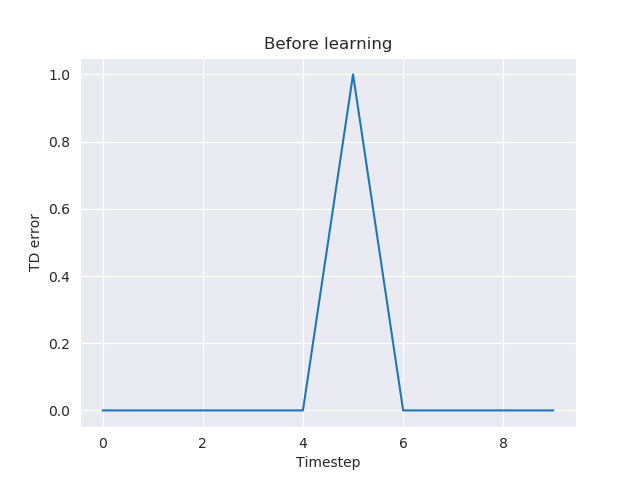

 After learning 

  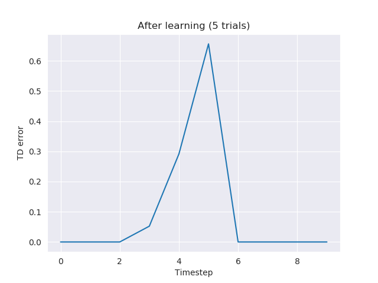
  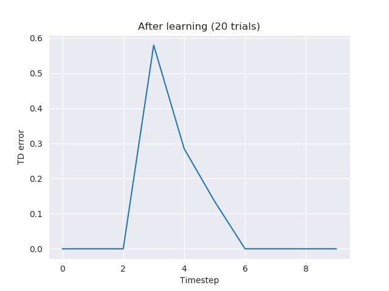
 

  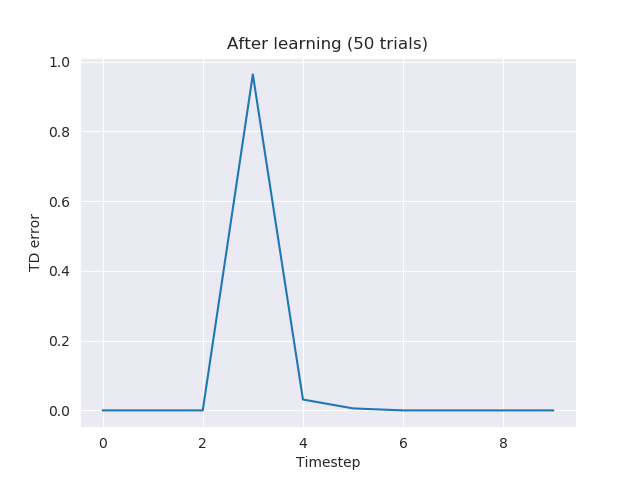
  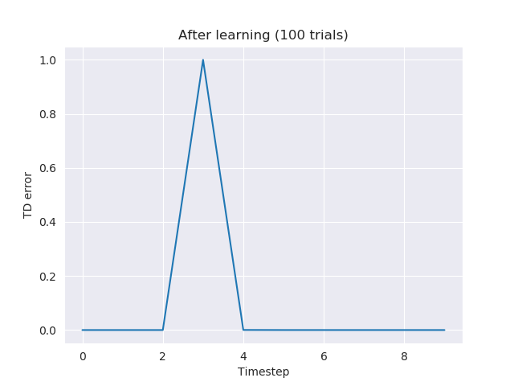

 Reward omission 

  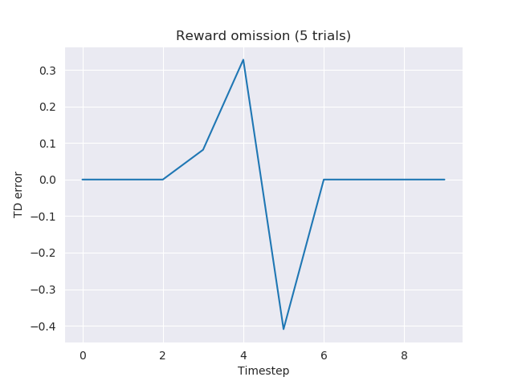
  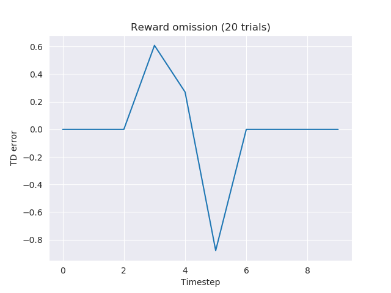
 

  
  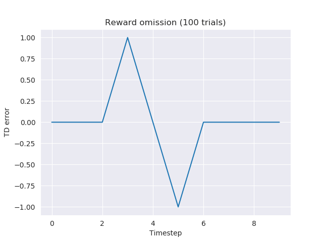

 Delayed reward 

  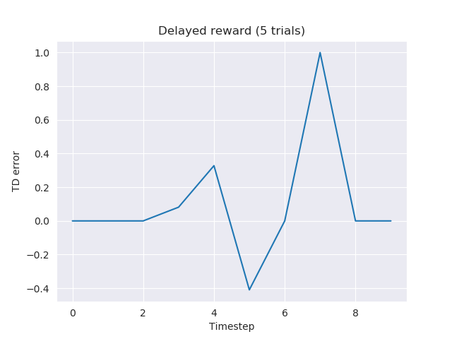
  
 

  
  

 Early reward 

  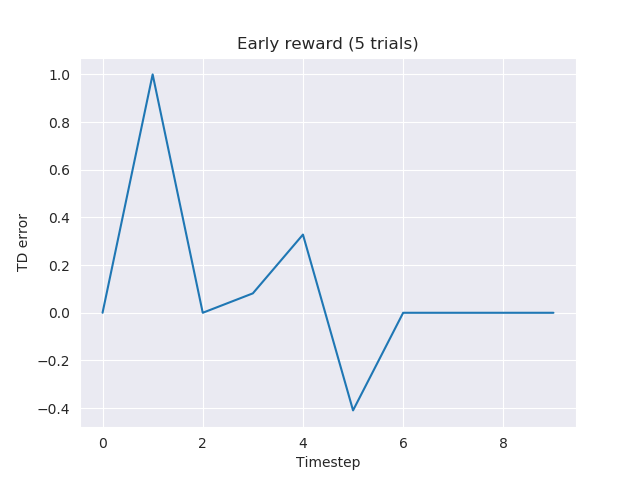
  
 

  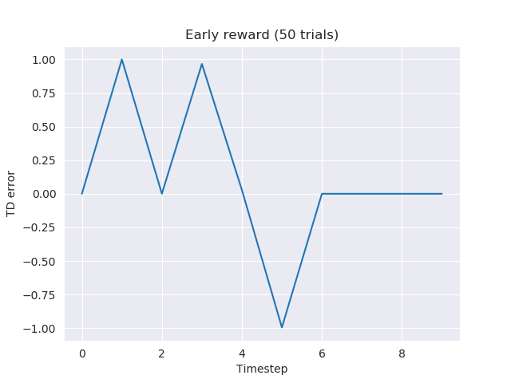
  

